<div align="center">
    
</div>

<div align="center">
    <a href="https://space.bilibili.com/483532108" target="_blank">
        
    </a>
    <a href="https://www.youtube.com/channel/UCkEziiyOnhvZgwCEk2WAb7Q" target="_blank">
        
    </a>
    <a href="README_EN.md" target="_blank">
        
    </a>
</div>
  
***  

  MojieAI开发的Comfyui自定义节点工具。为了让comfyui更加普及，让本地低配置电脑也同样能顺利的运行comfyui，同时避免在comfyui中调用外部API时密钥和地址难以统一管理，以及许多更优秀模型本地算力难以支撑，本地部署耗时耗力，因此mjapi-party将许多优秀常用的API节点做整合，只需要一个API-key即可以调用全网的API接口能力，也能够通过comfyui节点式操作，保留极大的灵活性，极大的拓展了comfyui的易用性。更多API节点正逐步添加中,后续也会逐步增加对扣子和n8n的支持。

***
要使用此节点需前往 [mojieaigc.com](https://www.mojieaigc.com/) 注册账户
详细说明查看
> [详细安装步骤](#安装步骤)

> [安装视频教程](https://ecn0nfqh6woh.feishu.cn/wiki/NSrhwpEEQis0b8ktIdAcEbN4neh?from=from_copylink)

> [摩诘AI的公开文档地址](https://ecn0nfqh6woh.feishu.cn/wiki/GITRwdanFi6gJHkYA9Nc9lDOnHd)

更多节点更新信息请关注B站'摩诘AI'，
[传送门](https://space.bilibili.com/483532108)

### 目前已支持的节点
- [图片翻译节点](/doc/node_list.md#图片翻译节点)
- [图片高清放大节点](/doc/node_list.md#图片高清放大节点)
- [seedance视频生成](/doc/node_list.md#seedance视频生成)
- [服装系列节点](/doc/node_list.md#服装系列节点)
- [seedream-4](/doc/node_list.md#seedream-4使用说明)
- [Gemini-NanoBanana](/doc/node_list.md#gemini-nanobanana使用说明)
- [Qwen-image](/doc/node_list.md#qwen-image-使用说明)
- [Qwen-edit-image](/doc/node_list.md#qwen-edit-image-使用说明)
- [seededit3.0](/doc/node_list.md#seededit30)
- [Dreamina(即梦参考生图)](/doc/node_list.md#dreamina即梦参考生图)
- [Redux万物迁移](/doc/node_list.md#redux万物迁移)
- [Kontext-pro&max](/doc/node_list.md#Kontext-pro&max)
- [自动抠图](/doc/node_list.md#自动抠图)

### 节点使用说明
所有的节点说明文档在：
> doc目录下[node_list.md](doc/node_list.md)

所有的节点示例工作流在：
> workflow目录下

在comfyui节点列表中找到mjapiparty


- 251012-新增图片翻译节点和图片高清放大节点
#### 图片翻译节点
该节点支持20多种语言，包括中文、英文、日文、韩文、法文、德文、西班牙文、葡萄牙文、意大利文、俄语等，可以将图片中的文字翻译成其他语言。
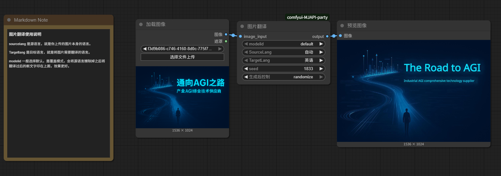

#### 图片高清放大节点
该节点可以将图片放大最高6倍，在保留细节的同时提高图片的清晰度。
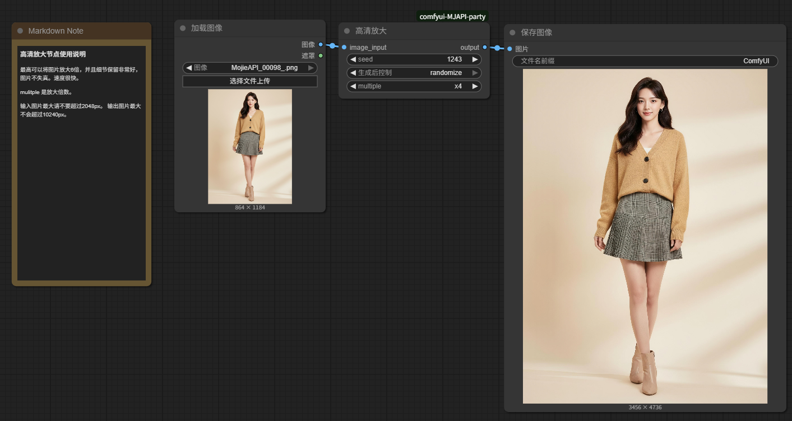

- 250929-新增seedance视频生成节点，原有即梦视频生成已下线.
#### seedance 视频生成节点使用说明
该模型语义理解与指令遵循能力强。运镜专业。支持多种视频风格，可以丝滑兼容各种风格的首图。分辨率支持480P、720P、1080P，时长支持3-10s，帧率24fps
camerafixed是固定镜头开关，开启后将忽略镜头运镜提示词。
duration是生成时长选项
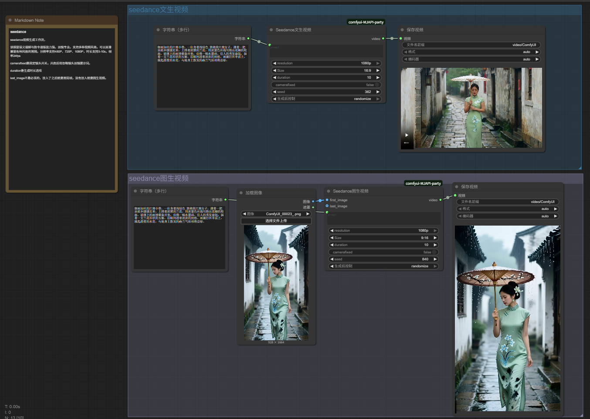
last_image不是必须的，接入了之后就是首尾帧，没有接入就是图生视频。
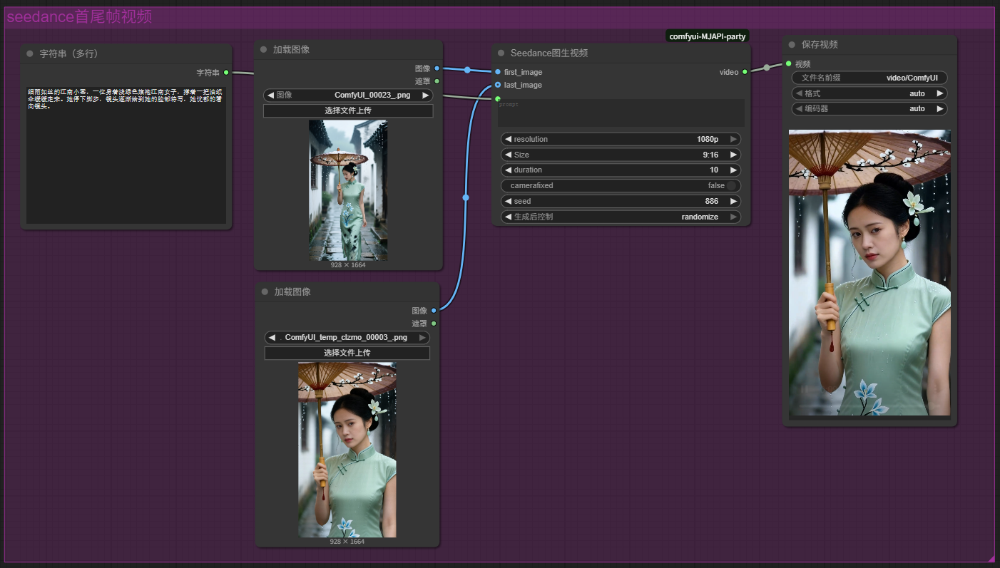


- 250920-新增服装系列节点
#### 服装系列节点
该节点是系列节点，也是摩诘AI首个集成工作流，因此无需复杂操作即可完成服装类的大部分工作，涵盖服装系列全流程工作流。其中有：服装模特生成，服装白底图提取，姿势更改和服装替换。详细操作教程参考工作流。工作流共有2个，1个是4功能合计，另一个是串联后的组图生成。工作流在workflow目录下，拖入comfyui即可使用.
4功能合集：
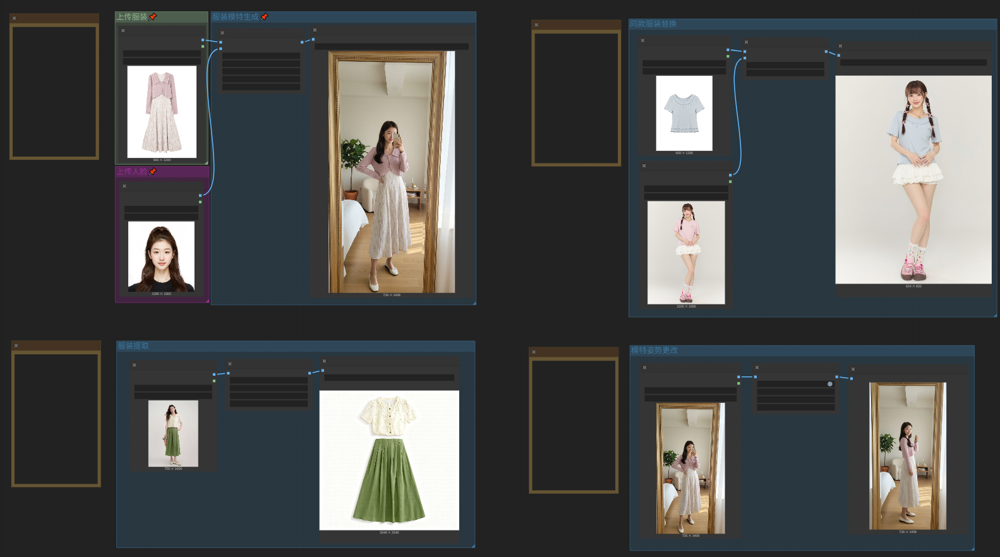
组图生成工作流：


- 250915-新增节点
#### seedream-4使用说明
Seedream 4.0 原生支持文本、单图和多图输入，实现基于主体一致性的多图融合创作、图像编辑、组图生成等多样玩法，实现包括组图生成、多参考图生图等图片生成能力。支持中文输入输出，支持多照片组合输入。seedream_v4支持4k高清输出，节点中配置了预设尺寸。
也可以通过自定义宽高来控制输出尺寸。custom_size是自定义尺寸的开关。
多图组合和Nano的不一样，无需拼接，可直接组合批次输入，seedream会自动拼接。最多可支持10张图片进行组合。


- 250902-新增节点
#### Gemini-NanoBanana使用说明
Gemini 2.5 Flash Image Preview又名NanoBanana是一款强大的图片编辑模型。
支持中文输入，不支持中文输出，同时也自带了翻译开关is_translation默认关闭
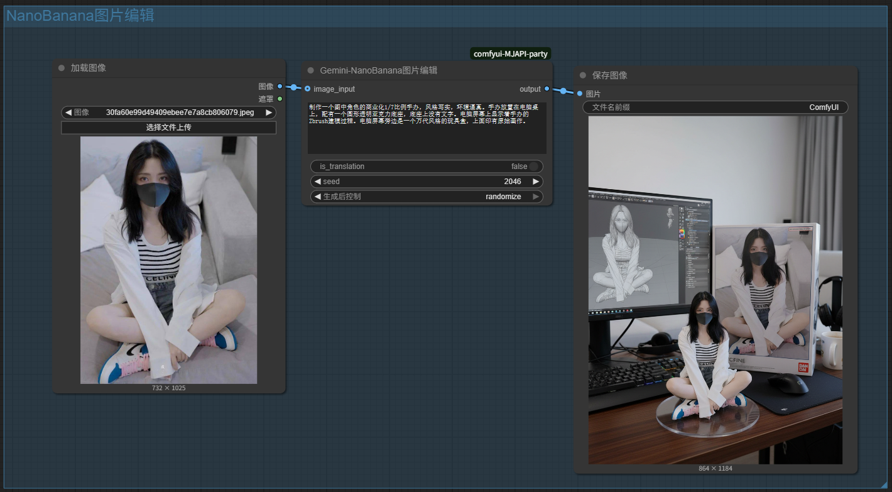
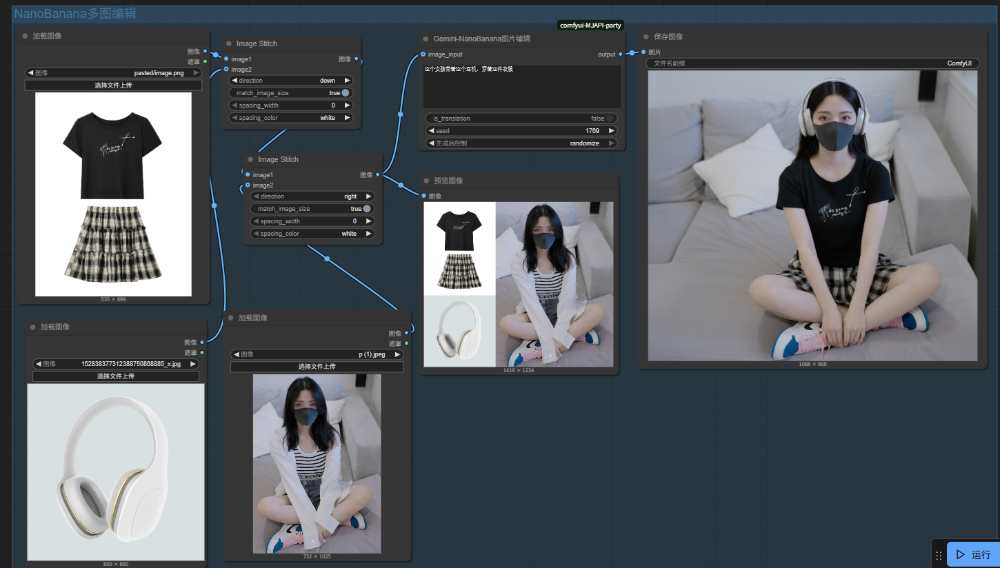


- 250820-新增节点
#### Qwen-image 
Qwen-image是阿里开源的AI绘画工具，对中文的支持非常友好，能够准确的画出细节的小字和排版，支持中文输入，中文输出。
prompt_extend是提示词扩写参数，默认开启，仅需简单提示词就可以出来非常不错的画面效果。
#### Qwen-edit-image
和seededit功能一样能通过文字描述修改图片。各有千秋，价格便宜，支持使用中文提示词，支持输出中文。

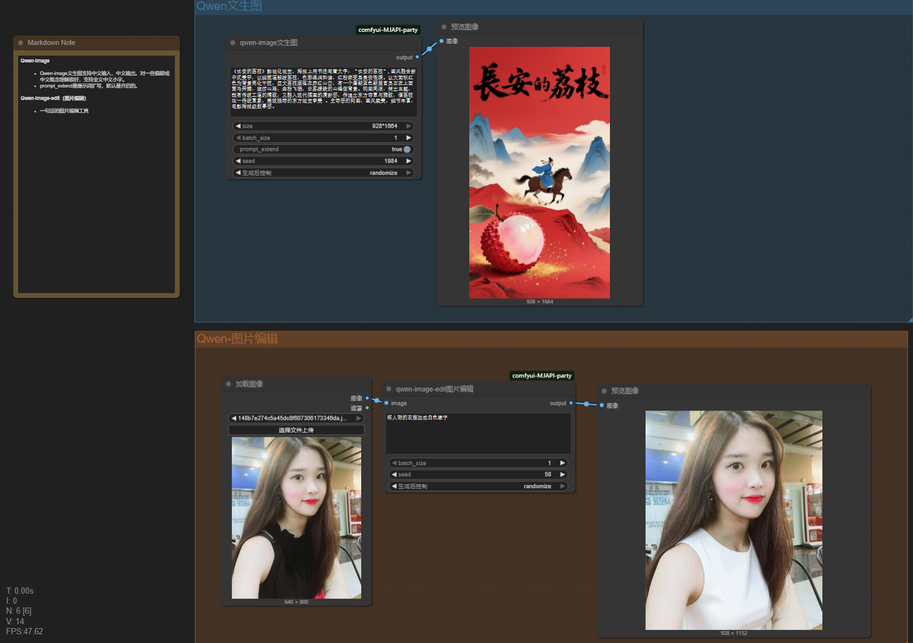

- 250714-新增节点：
seededit3.0
SeedEdit 3.0 是字节跳动开发的图片编辑工具，能通过文字描述修改图片。比如你说 “把背景换成海边”。支持使用中文提示词，支持输出中文，对比kontext一致性保持更好，支持中文提示词输入和中文文本输出。效果相当不错。
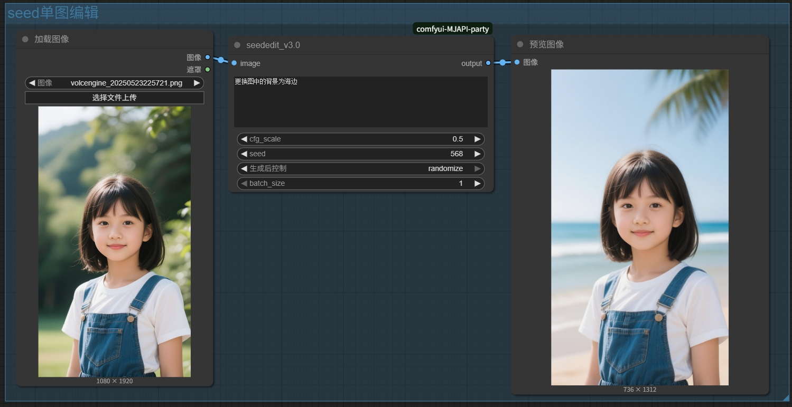
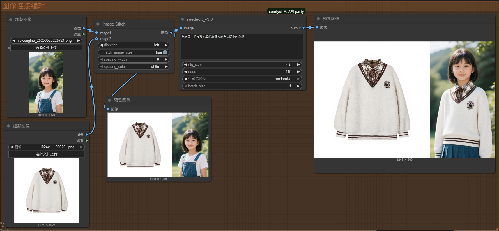

#### Kontext-pro&max
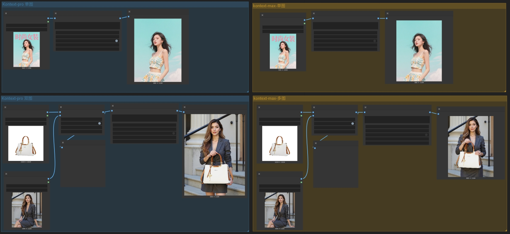
Kontext 是一个基于大模型的 AI 绘画工具，它可以通过文字描述生成图像。
- 加入了翻译开关is_translation,在每个节点中都有，默认是关闭的。打开可以输入中文。
- max效果更好，pro性价比更高。视频教程可以查看：
> [Kontext-pro&max详细测评教程](https://www.bilibili.com/video/BV19931zAE4c/?vd_source=25d3add966daa64cbb811354319ec18d#reply268510289936)
- 使用前请确保你的账户中有足够的余额

***


### 安装步骤
1. 确保你已经安装了ComfyUI。
2. 在comfyui-manager中搜索mojieapi_party直接安装本项目
3. 或者在comfyui/custom_nodes目录下
```plaintext
git clone https://github.com/MoJIeAIGC/comfyui-MJAPI-party.git
```
5. mojieaigc.com网站上注册一个账户
```url 
 https://www.mojieaigc.com
```

6. 登录后获取自己的API-KEY

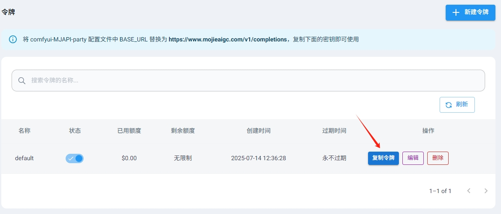

7. 修改`config.ini`文件，在项目目根目录下，内容示例如下：

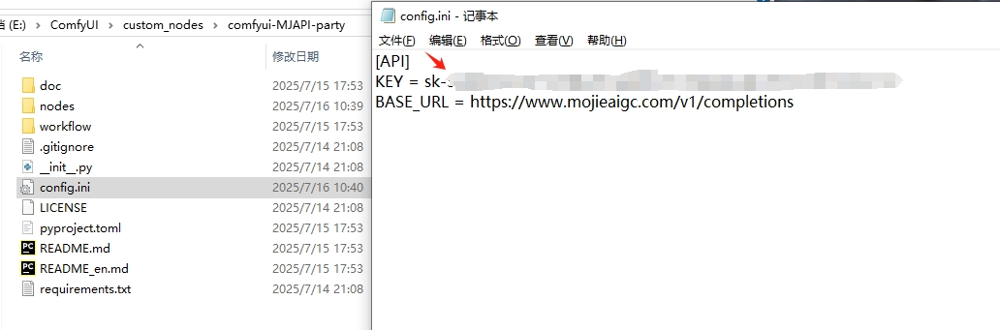

```ini
[API]
KEY = your_api_key
BASE_URL = https://www.mojieaigc.com/v1/completions
```
请求地址不要动，填入KEY就行了。
填入密钥key后记得重启comfyui,才能生效

### 联系我们
wechat:mojie_AIGC
扫描下方二维码
<div>
    
</div>
  

***
  
### star
<div align="center">
    <a href="https://star-history.com/#MoJIeAIGC/comfyui-MJAPI-party&Date">
        
    </a>
</div>
