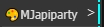

<div align="center">
    
</div>

<div align="center">
    <a href="https://space.bilibili.com/483532108" target="_blank">
        
    </a>
    <a href="#" target="_blank">
        
    </a>
    <a href="README_EN.md" target="_blank">
        
    </a>
</div>
  

***  

  MojieAI开发的Comfyui自定义节点工具。为了让comfyui更加普及，让本地低配置电脑也同样能顺利的运行comfyui，同时避免在comfyui中调用外部API时密钥和地址难以统一管理，以及许多更优秀模型本地算力难以支撑，本地部署耗时耗力，因此mjapi-party将许多优秀常用的API节点做整合，只需要一个API-key即可以调用全网的API接口能力，也能够通过comfyui节点式操作，保留极大的灵活性，极大的拓展了comfyui的易用性。更多API节点正逐步添加中,后续也会逐步增加对扣子和n8n的支持。

***
要使用此节点需前往 [mojieaigc.com](https://www.mojieaigc.com/) 注册账户
详细说明查看
> [详细安装步骤](#安装步骤)

> [安装视频教程](https://ecn0nfqh6woh.feishu.cn/wiki/NSrhwpEEQis0b8ktIdAcEbN4neh?from=from_copylink)

> [摩诘AI的公开文档地址](https://ecn0nfqh6woh.feishu.cn/wiki/GITRwdanFi6gJHkYA9Nc9lDOnHd?from=from_copylink)

更多节点更新信息请关注B站'摩诘AI'，
[传送门](https://space.bilibili.com/483532108)

### 目前已支持的节点
- [seededit3.0](/doc/node_list.md#seededit30)
- [Dreamina(即梦)](/doc/node_list.md#Dreamina(即梦)) 
- [Redux万物迁移](/doc/node_list.md#redux万物迁移)
- [Kontext-pro&max](/doc/node_list.md#Kontext-pro&max)
- [自动抠图](/doc/node_list.md#自动抠图)
- [即梦视频生成](/doc/node_list.md#即梦视频生成)

### 节点使用说明
所有的节点说明文档在：
> doc目录下[node_list.md](doc/node_list.md)

所有的节点示例工作流在：
> workflow目录下

在comfyui节点列表中找到mjapiparty


- 250722-新增节点
即梦视频文生视频和图生视频，即梦视频具有高语义遵循：具有极高的“提示词遵循能力”，支持输入很复杂的提示词（例如镜头切换、人物连续动作、情绪演绎、运镜控制）动效流畅：动作效果流畅自然，整体视频效果结构稳定,画面一致性：支持保持风格及主体一致性
如果你不想经常切换界面，或者在即梦中充值使用，或者批量生成，那么可以试试即梦视频生成工作流。


- 250714-新增节点：
seededit3.0
SeedEdit 3.0 是字节跳动开发的图片编辑工具，能通过文字描述修改图片。比如你说 “把背景换成海边”。支持使用中文提示词，支持输出中文，对比kontext一致性保持更好，支持中文提示词输入和中文文本输出。效果相当不错。


#### Redux万物迁移
这是flux-redux的迁移整合节点，一切都配置好了，无需下载模型，只需直接使用即可。

- migrate_image和migrate_mask是必选项上传需要被迁移的图片和迁移区域的遮罩。
- Product_image和Product_mask是上传迁移产品图，遮罩不是必须的。
- 但是可以给Product_mask细节处添加遮罩，可以让细节还原更加准确。
- 提示词可以不填，有默认提示词。或者简单形容一下这个是什么物品。
- 强度在0.6-0.9即可
#### Kontext-pro&max

Kontext 是一个基于大模型的 AI 绘画工具，它可以通过文字描述生成图像。
- 加入了翻译开关is_translation,在每个节点中都有，默认是关闭的。打开可以输入中文。
- max效果更好，pro性价比更高。视频教程可以查看：
> [Kontext-pro&max详细测评教程](https://www.bilibili.com/video/BV19931zAE4c/?vd_source=25d3add966daa64cbb811354319ec18d#reply268510289936)
- 使用前请确保你的账户中有足够的余额
#### Dreamina(即梦)

Dreamina是一个基于大模型的AI绘画工具，支持中文输入，中文输出，对一些偏僻或中文概念理解很好。特地将其加入在mjapiparty中是为了充分发挥comfyui灵活组合的能力，也懒得在即梦中充值了，mojie-api-party节点中有两个即梦节点，文生图与图生图。
***


### 安装步骤
1. 确保你已经安装了ComfyUI。
2. 在comfyui-manager中搜索mojieapi_party直接安装本项目
3. 或者在comfyui/custom_nodes目录下
```plaintext
git clone https://github.com/MoJIeAIGC/comfyui-MJAPI-party.git
```
4. 运行requirements安装依赖：
```bash
pip install -r requirements.txt
```
6. mojieaigc.com网站上注册一个账户
```url 
 https://www.mojieaigc.com
```

7. 登录后获取自己的API-KEY


8. 修改`config.ini`文件，在项目根目录下，内容示例如下：


```ini
[API]
KEY = your_api_key
BASE_URL = https://www.mojieaigc.com/v1/completions
```
请求地址不要动，填入KEY就行了。
填入密钥key后记得重启comfyui,才能生效

### 联系我们
wechat:mojie_AIGC
扫描下方二维码
<div>
    
</div>
  

***
  
### star
<div align="center">
    <a href="https://star-history.com/#MoJIeAIGC/comfyui-MJAPI-party&Date">
        
    </a>
</div>
