#### 所有API节点列表
所有的节点示例工作流都可以在workflow目录下找到
- [gpt-image-2](#gpt-image-2)
- [多图上传节点](#多图上传节点)
- [Gemini3-Nano节点](#gemini3-nano节点)
- [Gemini3-LLM](#gemini3-llm节点)
- [Nano-pro节点](#nano-pro节点)
- [Flux-2-pro节点](#Flux-2-pro节点)
- [图片翻译节点](#图片翻译节点)
- [图片高清放大节点](#图片高清放大节点)
- [seedance 视频生成节点](#seedance-视频生成节点使用说明)
- [服装系列节点](#服装系列节点)
- [seedream-4.0](#seedream-4使用说明)
- [Gemini-NanoBanana](#gemini-nanobanana使用说明)
- [Qwen-image](#qwen-image-使用说明)
- [Qwen-edit-image](#qwen-edit-image-使用说明)
- [自动抠图](#自动抠图)

***
- 删除了一些现在已经没有人用的节点，如Kontext-pro&max,seededit3
### 更新happyhorse视频生成节点
happyhorse参考生视频功能和文生图生视频。
happyhorse虽然在动作方面不太行，但是电商的产品稳定性上还不错，至少审核非常宽松。
- 使用[image N]N为你的图片顺序，来引用参考图片。
- 参考生视频最多支持9张图，多了会被抛弃。
- resolution 是视频分辨率
- Size是生成尺寸。
- duration 是生成时长，最多15s

#### 更新chatgpt-image-2 图像生成节点
效果非常不错，但是价格也是真的不便宜,工作流在workflow目录下。
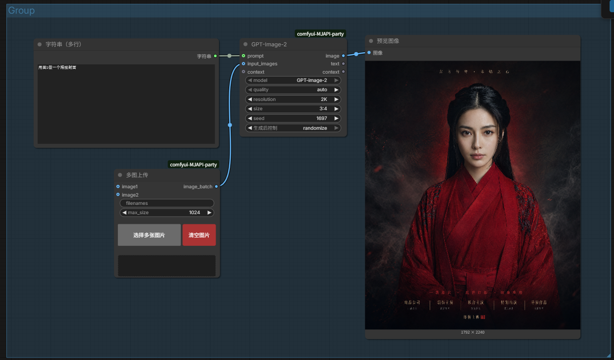

#### 多图上传节点
这个节点支持最多10张照片上传参考
非常好用

#### Gemini3-LLM节点
这是gemini3的大语言模型节点。支持上下文。接入上下文管理即可直接读取上下文,也可以直接将多个LLM节点短接。更多用法可咨询摩摩AI，或查看我们相关教程.
支持Gemini3的全量参数
- 通过model参数选择不同模型
- mdeia_resolution是输入图像参考程度
- thinking_level是思考等级
- System_prompt是系统提示词，如果你学过大语言模型就知道该怎么用。
- web_search是网络搜索开关。
- formpt是结构化输出参数，用于指定输出的格式。
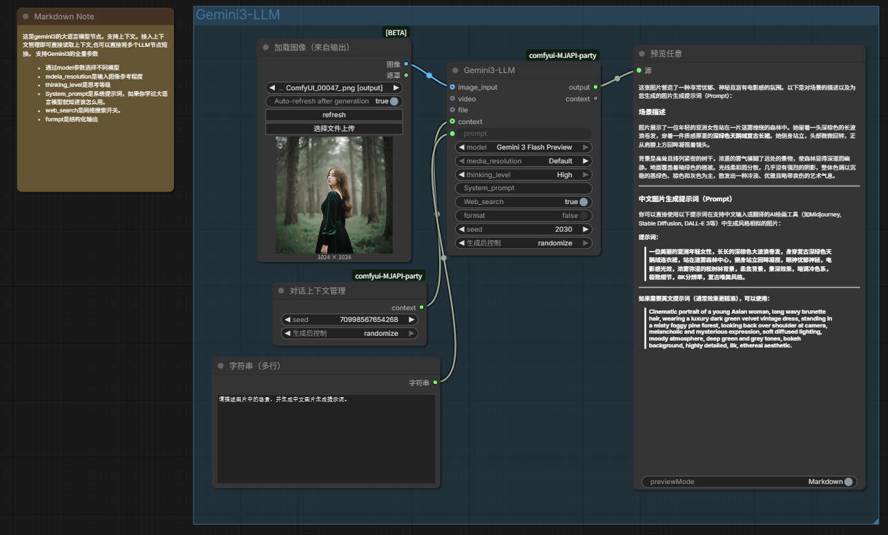

#### Gemini3-Nano节点
这是gemini-nano的满血节点。支持上下文多轮编辑。接入上下文管理即可直接读取上下文。
支持Gemini的全量参数
- mdeia_resolution是输入图像参考程度
- thinking_level是思考等级
- safe_level是图片安全等级
- resolution是输出图片分辨率，2.5不支持2K,4K,Gemini3支持.
- System_prompt是系统提示词，如果你学过大语言模型就知道该怎么用。
- web_search是网络搜索开关。

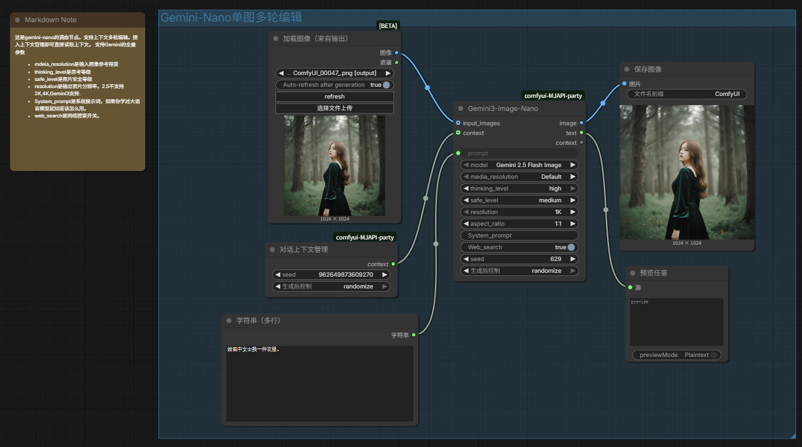

#### Nano-pro节点
NanoBanana-pro又名Gemini 3 Flash Image Preview,是google旗下的图像生成模型，功能强大，支持中英文输入和中英文文字输出，对图像理解能力非常强。支持1K、2K、4K分辨率

#### Flux-2-pro节点
flux-2(pro)是黑森林AI旗下FLUX系列产品，支持中英文输入输出。支持多图编辑，在图像表现上和Nano各有特色，并且支持精准的颜色编辑。
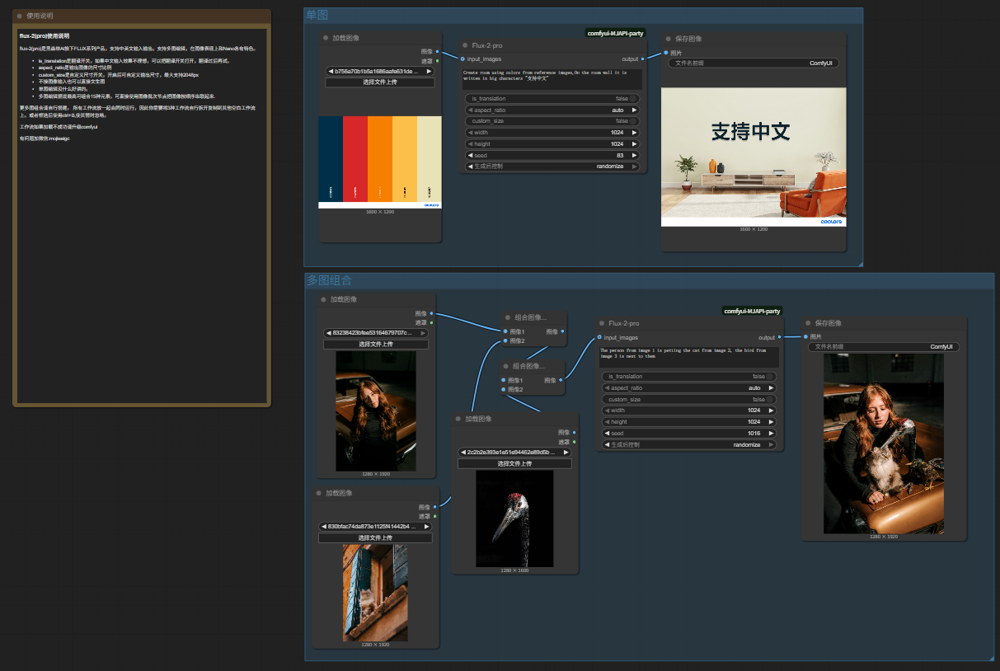

#### 图片翻译节点
该节点支持20多种语言，包括中文、英文、日文、韩文、法文、德文、西班牙文、葡萄牙文、意大利文、俄语等，可以将图片中的文字翻译成其他语言。
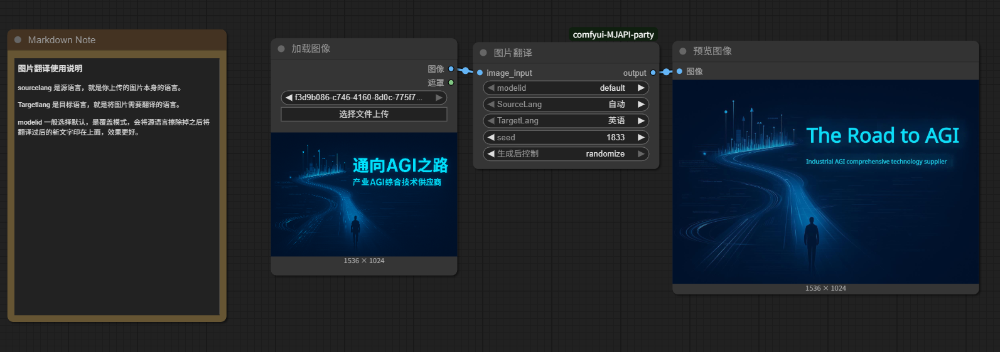

#### 图片高清放大节点
该节点可以将图片放大最高6倍，在保留细节的同时提高图片的清晰度。
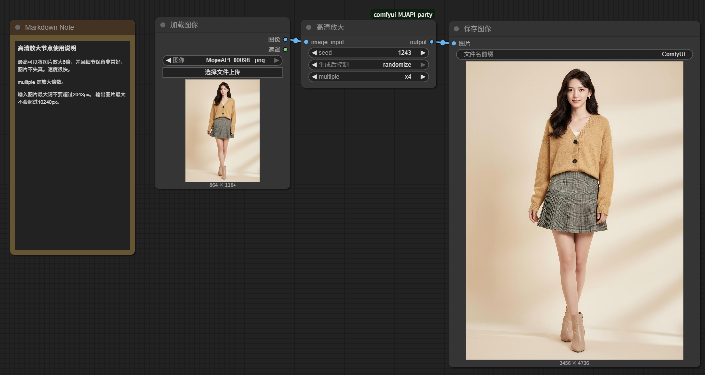

#### seedance 视频生成节点使用说明
该模型语义理解与指令遵循能力强。运镜专业。支持多种视频风格，可以丝滑兼容各种风格的首图。分辨率支持480P、720P、1080P，时长支持3-10s，帧率24fps
camerafixed是固定镜头开关，开启后将忽略镜头运镜提示词。
duration是生成时长选项
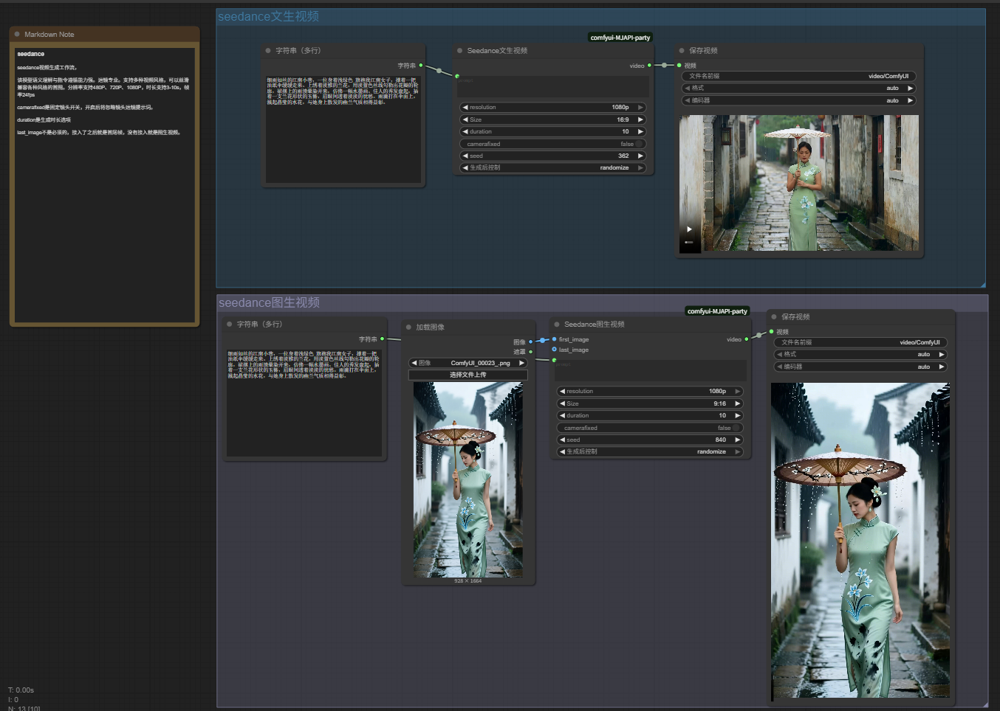
last_image不是必须的，接入了之后就是首尾帧，没有接入就是图生视频。
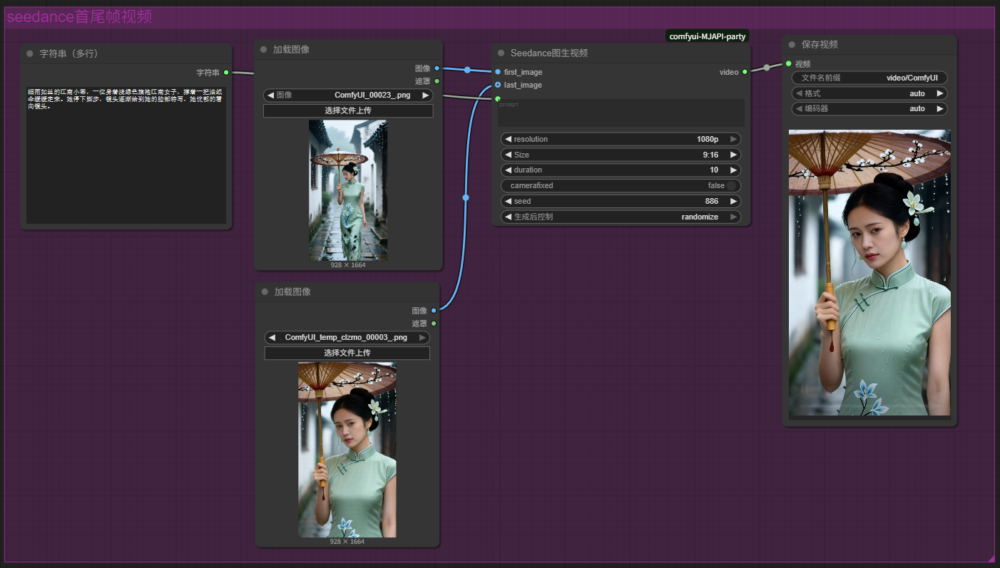

#### 服装系列节点
该节点是系列节点，涵盖服装系列全流程工作流。其中有：服装模特生成，服装白底图提取，姿势更改和服装替换。详细操作教程参考工作流。工作流共有2个，1个是4功能合计，另一个是串联后的组图生成。
4功能合集：
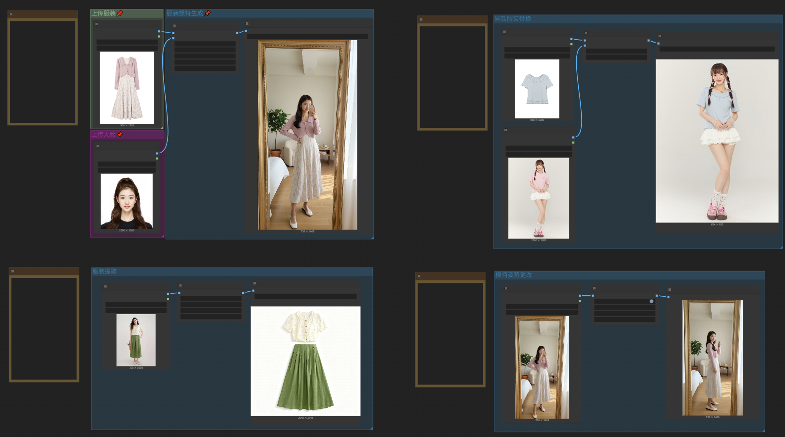
组图生成工作流：
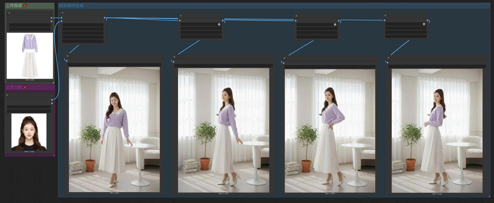

#### seedream-4.5使用说明
Seedream 4.5 原生支持文本、单图和多图输入，实现基于主体一致性的多图融合创作、图像编辑、组图生成等多样玩法，实现包括组图生成、多参考图生图等图片生成能力。支持中文输入输出，支持多照片组合输入。seedream_v4支持4k高清输出，节点中配置了预设尺寸。
也可以通过自定义宽高来控制输出尺寸。custom_size是自定义尺寸的开关。
多图组合和Nano的不一样，无需拼接，可直接组合批次输入，seedream会自动拼接。最多可支持10张图片进行组合。

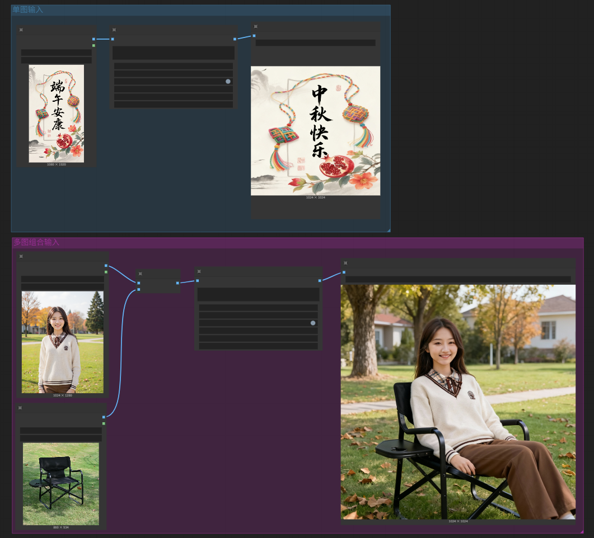

#### Gemini-NanoBanana使用说明
NanoBanana又名Gemini 2.5 Flash Image Preview,是google旗下的图片编辑工具。提示词遵循强度很高。基本不需要特别的提示词格式，支持中英文输入，但是不支持中文输出，可输出英文字体。
is_translation是翻译开关，如果中文输入效果不理想，可以把翻译开关打开，翻译过后再试。
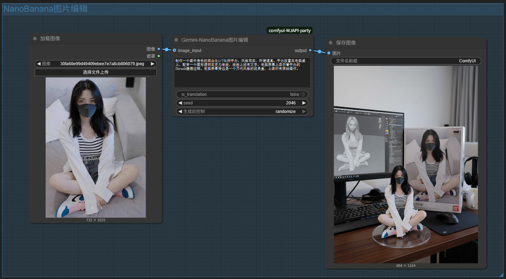
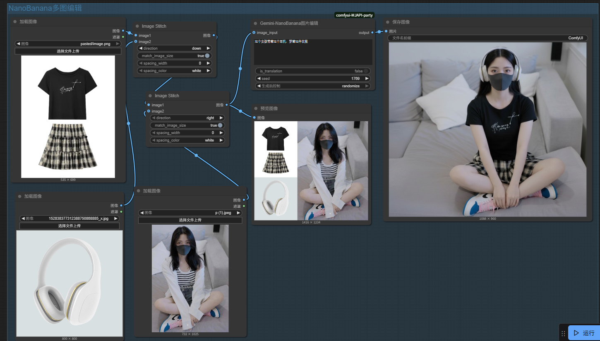

#### Qwen-image 使用说明
Qwen-image是阿里开源的AI绘画工具，对中文的支持非常友好，能够准确的画出细节的小字和排版，支持中文输入，中文输出。
prompt_extend是提示词扩写参数，默认开启，仅需简单提示词就可以出来非常不错的画面效果。
#### Qwen-edit-image 使用说明
和seededit功能一样能通过文字描述修改图片。各有千秋，价格便宜，支持使用中文提示词，支持输出中文。具体使用方法和标准提示词可以参考seededit
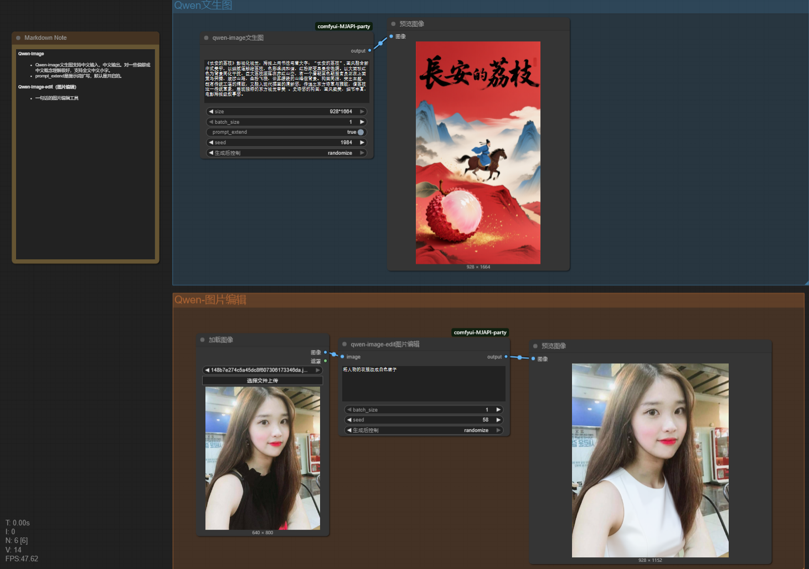

用于编辑图像的提示词 ,建议：
- 建议长度 <= 120字符，prompt过长有概率出图异常或不生效
- 编辑指令使用自然语言即可
- 每次编辑使用单指令会更好
- 局部编辑时指令描述尽量精准，尤其是画面有多个实体的时候，描述清楚对谁做什么，能获取更精准的编辑效果
- 发现编辑效果不明显的时候，可以调整一下编辑强度cfg_scale，数值越大越贴近指令执行
尽量使用清晰的，分辨率高的底片.
##### 提示词参考示例：
- 添加/删除实体：添加/删除xxx（删除图上的女孩/添加一道彩虹）
- 修改实体：把xxx改成xxx（把手里的鸡腿变成汉堡）
- 修改风格：改成xxx风格（改成漫画风格）
- 修改色彩：把xxx改成xx颜色（把衣服改成粉色的）
- 修改动作：修改表情动作（让他哭/笑/生气）
- 修改环境背景：背景换成xxx，在xxx（背景换成海边/在星空下）
***

##### 自动抠图
图片上传最大不超过10M
用就行了，没啥参数。
带了遮罩就按遮罩范围抠图

