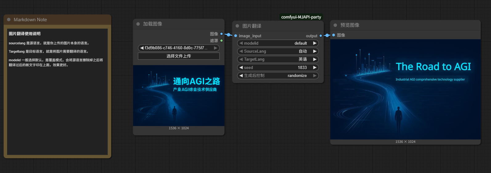
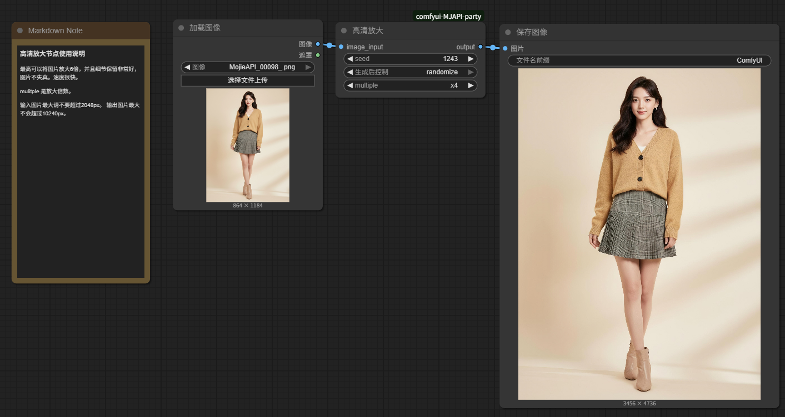
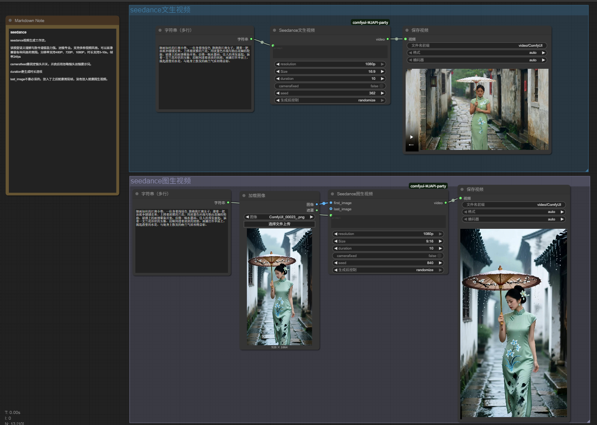
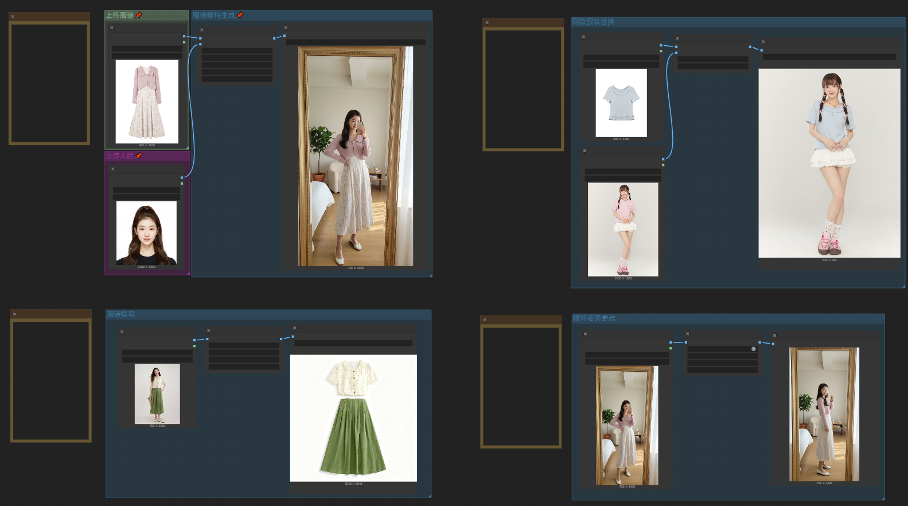
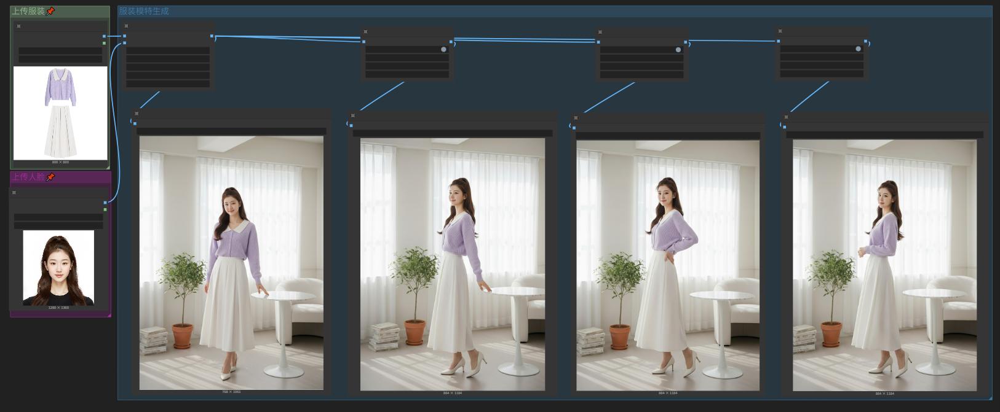
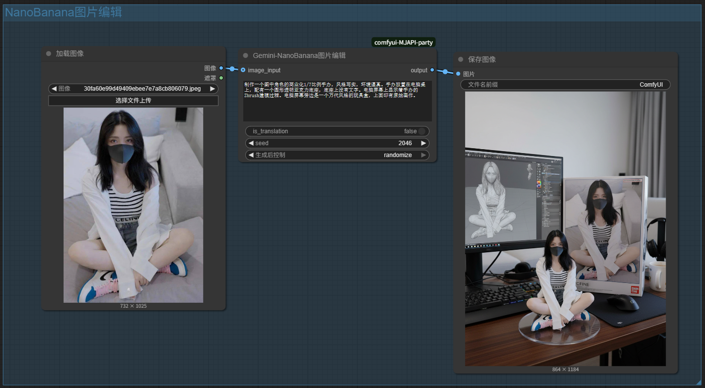
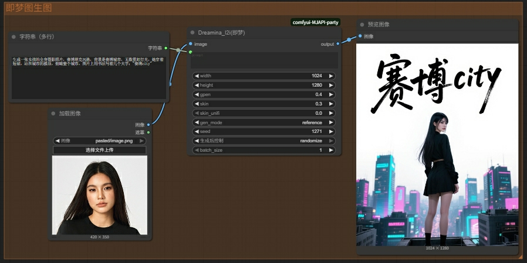

#### 所有API节点列表
所有的节点示例工作流都可以在workflow目录下找到
- [Nano-pro节点](#nano-pro节点)
- [Flux-2-pro节点](#Flux-2-pro节点)
- [图片翻译节点](#图片翻译节点)
- [图片高清放大节点](#图片高清放大节点)
- [seedance 视频生成节点](#seedance-视频生成节点使用说明)
- [服装系列节点](#服装系列节点)
- [seedream-4.0](#seedream-4使用说明)
- [Gemini-NanoBanana](#gemini-nanobanana使用说明)
- [Qwen-image](#qwen-image-使用说明)
- [Qwen-edit-image](#qwen-edit-image-使用说明)
- [seededit3.0](#seededit30)
- [Redux万物迁移](#redux万物迁移)
- [Kontext-pro&max](#Kontext-pro&max)
- [自动抠图](#自动抠图)
- [Dreamina(即梦参考生图)](#dreamina即梦参考生图)

***
#### Gemini3-LLM节点
这是gemini3的大语言模型节点。支持上下文。接入上下文管理即可直接读取上下文,也可以直接将多个LLM节点短接。更多用法可咨询摩诘AI，或查看我们相关教程.
支持Gemini3的全量参数
- 通过model参数选择不同模型
- mdeia_resolution是输入图像参考程度
- thinking_level是思考等级
- System_prompt是系统提示词，如果你学过大语言模型就知道该怎么用。
- web_search是网络搜索开关。
- formpt是结构化输出参数，用于指定输出的格式。

#### Gemini3-Nano节点
这是gemini-nano的满血节点。支持上下文多轮编辑。接入上下文管理即可直接读取上下文。
支持Gemini的全量参数
- mdeia_resolution是输入图像参考程度
- thinking_level是思考等级
- safe_level是图片安全等级
- resolution是输出图片分辨率，2.5不支持2K,4K,Gemini3支持.
- System_prompt是系统提示词，如果你学过大语言模型就知道该怎么用。
- web_search是网络搜索开关。

#### Nano-pro节点
NanoBanana-pro又名Gemini 3 Flash Image Preview,是google旗下的图像生成模型，功能强大，支持中英文输入和中英文文字输出，对图像理解能力非常强。支持1K、2K、4K分辨率

#### Flux-2-pro节点
flux-2(pro)是黑森林AI旗下FLUX系列产品，支持中英文输入输出。支持多图编辑，在图像表现上和Nano各有特色，并且支持精准的颜色编辑。

#### 图片翻译节点
该节点支持20多种语言，包括中文、英文、日文、韩文、法文、德文、西班牙文、葡萄牙文、意大利文、俄语等，可以将图片中的文字翻译成其他语言。

#### 图片高清放大节点
该节点可以将图片放大最高6倍，在保留细节的同时提高图片的清晰度。

#### seedance 视频生成节点使用说明
该模型语义理解与指令遵循能力强。运镜专业。支持多种视频风格，可以丝滑兼容各种风格的首图。分辨率支持480P、720P、1080P，时长支持3-10s，帧率24fps
camerafixed是固定镜头开关，开启后将忽略镜头运镜提示词。
duration是生成时长选项

last_image不是必须的，接入了之后就是首尾帧，没有接入就是图生视频。

#### 服装系列节点
该节点是系列节点，涵盖服装系列全流程工作流。其中有：服装模特生成，服装白底图提取，姿势更改和服装替换。详细操作教程参考工作流。工作流共有2个，1个是4功能合计，另一个是串联后的组图生成。
4功能合集：

组图生成工作流：

#### seedream-4使用说明
Seedream 4.0 原生支持文本、单图和多图输入，实现基于主体一致性的多图融合创作、图像编辑、组图生成等多样玩法，实现包括组图生成、多参考图生图等图片生成能力。支持中文输入输出，支持多照片组合输入。seedream_v4支持4k高清输出，节点中配置了预设尺寸。
也可以通过自定义宽高来控制输出尺寸。custom_size是自定义尺寸的开关。
多图组合和Nano的不一样，无需拼接，可直接组合批次输入，seedream会自动拼接。最多可支持10张图片进行组合。

#### Gemini-NanoBanana使用说明
NanoBanana又名Gemini 2.5 Flash Image Preview,是google旗下的图片编辑工具。提示词遵循强度很高。基本不需要特别的提示词格式，支持中英文输入，但是不支持中文输出，可输出英文字体。
is_translation是翻译开关，如果中文输入效果不理想，可以把翻译开关打开，翻译过后再试。

#### Qwen-image 使用说明
Qwen-image是阿里开源的AI绘画工具，对中文的支持非常友好，能够准确的画出细节的小字和排版，支持中文输入，中文输出。
prompt_extend是提示词扩写参数，默认开启，仅需简单提示词就可以出来非常不错的画面效果。
#### Qwen-edit-image 使用说明
和seededit功能一样能通过文字描述修改图片。各有千秋，价格便宜，支持使用中文提示词，支持输出中文。具体使用方法和标准提示词可以参考seededit

#### seededit3.0 使用说明
SeedEdit 3.0 是字节跳动开发的图片编辑工具，
能通过文字描述修改图片。比如你说 “把背景换成海边”。支持使用中文提示词，支持输出中文。

用于编辑图像的提示词 ,建议：
- 建议长度 <= 120字符，prompt过长有概率出图异常或不生效
- 编辑指令使用自然语言即可
- 每次编辑使用单指令会更好
- 局部编辑时指令描述尽量精准，尤其是画面有多个实体的时候，描述清楚对谁做什么，能获取更精准的编辑效果
- 发现编辑效果不明显的时候，可以调整一下编辑强度cfg_scale，数值越大越贴近指令执行
尽量使用清晰的，分辨率高的底片.
##### 提示词参考示例：
- 添加/删除实体：添加/删除xxx（删除图上的女孩/添加一道彩虹）
- 修改实体：把xxx改成xxx（把手里的鸡腿变成汉堡）
- 修改风格：改成xxx风格（改成漫画风格）
- 修改色彩：把xxx改成xx颜色（把衣服改成粉色的）
- 修改动作：修改表情动作（让他哭/笑/生气）
- 修改环境背景：背景换成xxx，在xxx（背景换成海边/在星空下）
***
#### Redux万物迁移
这是flux-redux的迁移整合节点，一切都配置好了，无需下载模型，只需直接使用即可。

- migrate_image和migrate_mask是必选项上传需要被迁移的图片和迁移区域的遮罩。
- Product_image和Product_mask是上传迁移产品图，遮罩不是必须的。
- 但是可以给Product_mask细节处添加遮罩，可以让细节还原更加准确。
- 提示词可以不填，有默认提示词。或者简单形容一下这个是什么物品。
- 强度在0.6-0.9即可
#### Kontext-pro&max

Kontext 是一个基于大模型的 AI 绘画工具，它可以通过文字描述生成图像。
- 加入了翻译开关is_translation,在每个节点中都有，默认是关闭的。打开可以输入中文。
- aspect_ratio是尺寸控制，默认是default，由kontext自己控制输出图片的尺寸。也可以开启根据自己的需要选择尺寸。
- max效果更好，pro性价比更高。视频教程可以查看：
> [Kontext-pro&max详细测评教程](https://www.bilibili.com/video/BV19931zAE4c/?vd_source=25d3add966daa64cbb811354319ec18d#reply268510289936)
- 使用前请确保你的账户中有足够的余额

#### Dreamina(即梦参考生图)
加入Qwen-image后，即梦文身图就没有太多存在的意义了，完全可以平替即梦。但是即梦的参考生图还是非常不错的，在人像还原上也非常准确。

即梦图生图有多种参考模式gen_mode选下下
第一种 creative 是创意模式，可以理解为全图参考
第二种 reference 人脸参考
第三种 reference_char 人物参考
cfg默认2.5请勿修改

##### 自动抠图
图片上传最大不超过10M
用就行了，没啥参数。
带了遮罩就按遮罩范围抠图

